# Delícias Caseiras

# **Introduction**

The **Delícias Caseiras** application was developed to optimize and simplify the internal management of orders and deliveries, customers, employees, and stocks of a take-away establishment. This application is dedicated exclusively to internal use, aiming to improve operational efficiency and enhance the customer experience.

Through the classes used, the application accurately models all stages of the process. All information is stored in CSV files for later consultation or data storage.

When customers place orders through social networks or telephone contact, they are entered into the system by an employee who monitors this section, taking appropriate follow-up until they reach the customer's home.

The different sections of the program will be available depending on the position in the company, as soon as the employee enters the access credentials.

Each order has distinct states, from "pending" to "delivered," with specific dates assigned.

The **Restaurant** class assumes responsibility for storing the record of all orders, maintaining global tracking of ongoing operations.

The interactive form provides features such as adding, excluding, editing, and removing customers, stocks, employees, and orders. In addition, the application offers the facility to calculate the total value of each order, considering the selected dishes and drinks, as well as verifying the amount invoiced per customer in a designated time interval.

The implementation of an order status forecast system further enhances customer service, ensuring timely and reliable deliveries, as any delay that occurs will be alerted.

In short, the **Delícias Caseiras** application represents a technological solution dedicated exclusively to the internal management of the establishment, promoting an agile and precise organization of all the processes involved.

# **Functionalities**

## **Login**  

- Employee Authentication: After entering the NIF and password, the application checks whether the credentials provided correspond to an existing user in the system.
- Reading Data from a CSV File: The application loads employee information from a CSV file called "employees.csv". This data is used for authentication.
- Function Differentiation: Based on the Employee's role (manager or non-manager), the application enables different sets of functionalities. Managers have access to a broader set of resources than regular employees.
- Password Masking: The application offers the option to hide or display the password entered by the user, thus providing an additional layer of security in the login interface.
- Incorrect Authentication Feedback: If the login credentials are incorrect, the application will display an error message informing the user that the information provided is incorrect.

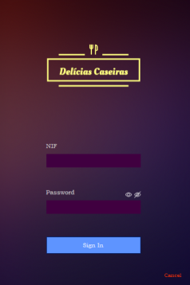

If you have full access, that is, if you are the "Manager", the Menu will be presented as follows:

On the other hand, if it is an employee who is not a "Manager", the Menu will be presented as follows:

### **Employees**  

- Data Loading: Upon initialization, the code checks for employee data previously loaded from a CSV file. If the data is not loaded, it reads this file to fill in the employee list, ensuring that the information is always up to date and available.
- Data Display: Employee details are presented in a table in the graphical interface, where fields such as name, age, telephone number, NIF, password, address, salary and role are displayed in separate columns. This allows for an organized view of employee information.
- Adding Employees: The Manager can add new employees by clicking on a specific image (representing the add action). This opens a window that allows you to enter information for a new employee. After addition, the information is updated in the employee list.
- Employee Editing: By clicking on edit image in the row corresponding to an employee in the table, the manager can modify the details of that employee. After editing, the changes are reflected in the list and in the CSV file.
- Deletion of Employees: The code also allows for the exclusion of employees. When the delete image in the employee row is clicked, a confirmation is requested and if confirmed, the employee is removed from the list and the changes are reflected in the CSV file.
- Employee Search by Name: There is a search field where you can type an employee's name. As search text is entered, the code dynamically filters the results displayed in the table, showing only employees whose names match the text entered, making it easier to find specific employees.

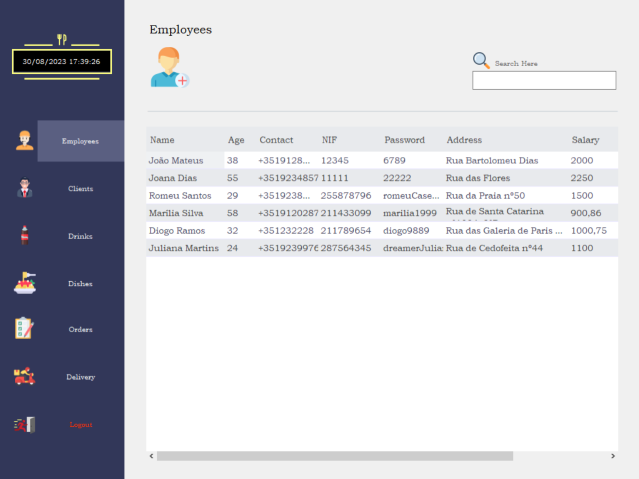

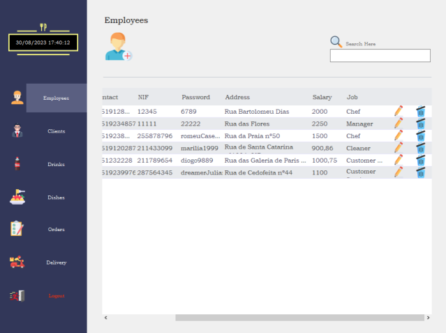

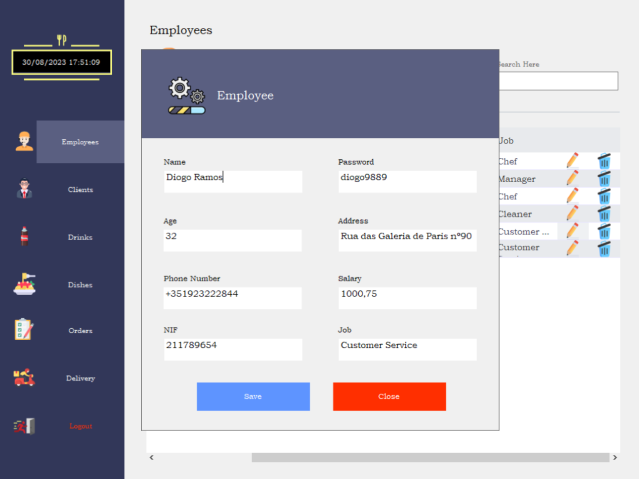

### **Clients**  

- Data Loading: When the interface is initialized, the code checks for previously loaded customer data from a CSV file. If there is no data, it reads this file to populate the customer table, ensuring the information is up-to-date and ready to use.
- Data Display: Customer details are displayed in a table in the graphical interface. Fields such as name, telephone number, address and NIF (Tax Identification Number) are displayed in separate columns, allowing users to view the information in an organized manner.
- Adding Customers: When clicking on an intuitive image, the application opens a window that allows the Manager to add new customers. After addition, the information is updated in the list and in the CSV file.
- Editing Customers: By clicking on the editing image in the row corresponding to a customer in the table, the Manager can modify the details of that customer. After editing, the changes are reflected in the list and in the CSV file.
- Exclusion of Customers: The application also allows the exclusion of customers. When clicking the delete image in the customer row, a confirmation is requested and if confirmed, the customer is removed from the list and the changes are reflected in the CSV.
- Customer search by name: There is a search field where you can type a customer's name. As search text is entered, the code dynamically filters the results displayed in the table, showing only those customers whose names match the text entered, making it easier to find specific customers.
- Calculator: When clicking on the image representing a calculator, the application opens a window to perform calculations between dates of the amount spent for a certain previously selected customer.

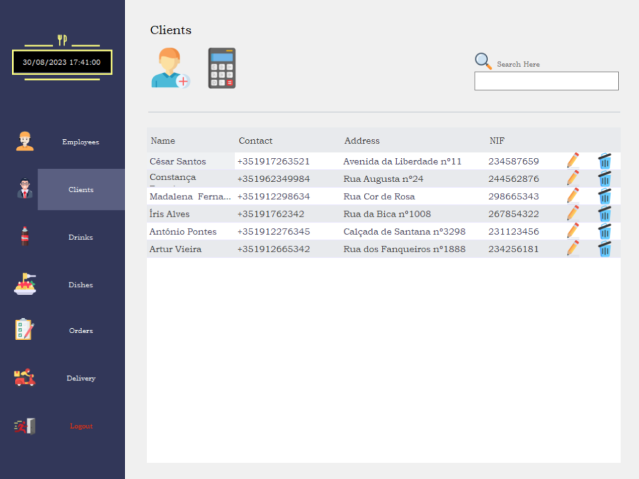

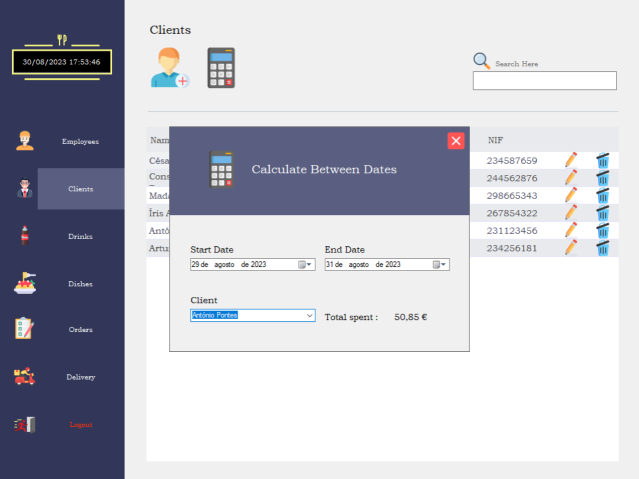

### **Drinks and Dishes**  

The Dishes and Drinks panels have the same functionalities as the fields are the same.
- Data Loading: Upon initialization, both panels check for item data (drinks or dishes) previously loaded from CSV files. If there is no data, they load that data from files, ensuring the information is always up to date and ready to use.
- Data Display: Item details (name, description, price and stock) are displayed in the corresponding table in the graphical interface. This allows information to be viewed in an organized and effective way.
- Adding Items: When clicking on a specific image, both panels open a window that allows you to add new items to the menu (drinks or dishes). After addition, the information is updated in the item list and corresponding CSV file.
- Editing Items: By clicking on the editing image in a corresponding line in an item in the corresponding table, the details of that item (name, description, price and stock) can be modified. After edits, the changes are reflected  in the list and are saved in the corresponding CSV files.
- Deleting Items: The application also allows you to delete items. When clicking the delete image in an item row, a confirmation is requested and if confirmed, the item is removed from the list and the changes are reflected in the corresponding CSV files.
- Search for Items by Name: Both panels have a search field where users can enter the name of an item. As search text is entered, the codes dynamically filter the results displayed in the table, showing only those items whose names match the text entered, making it easier to find specific items.

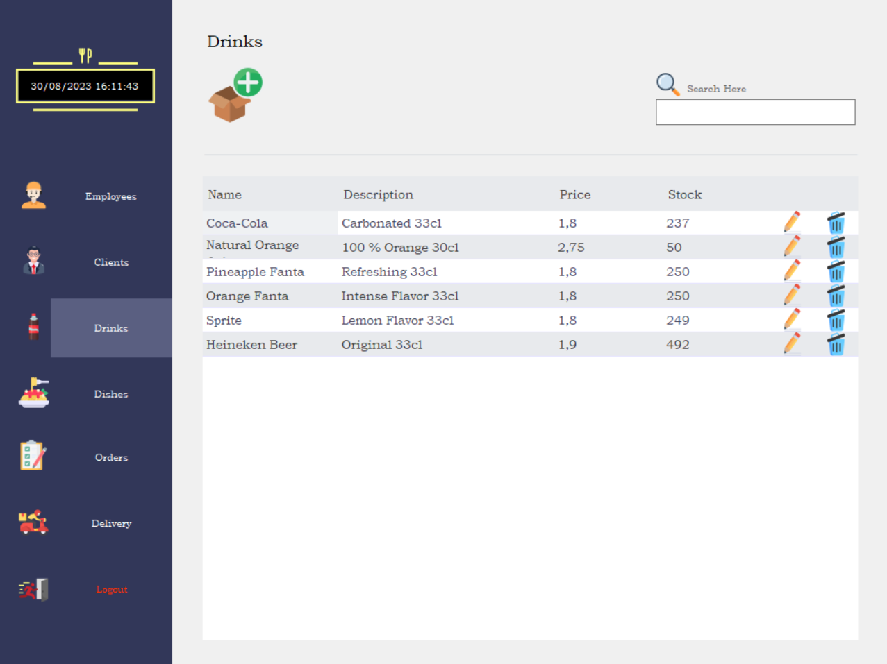

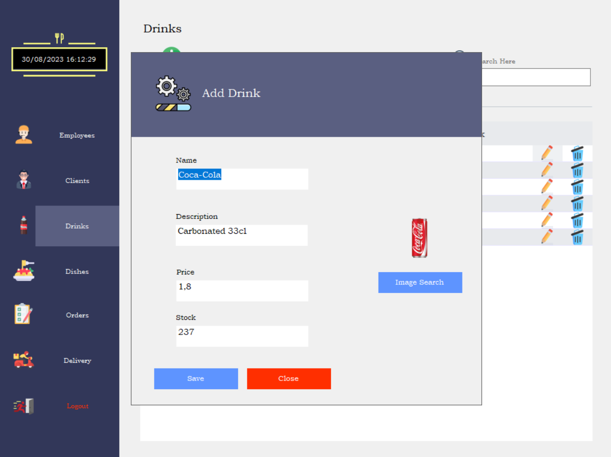

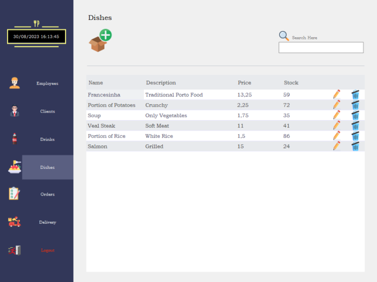

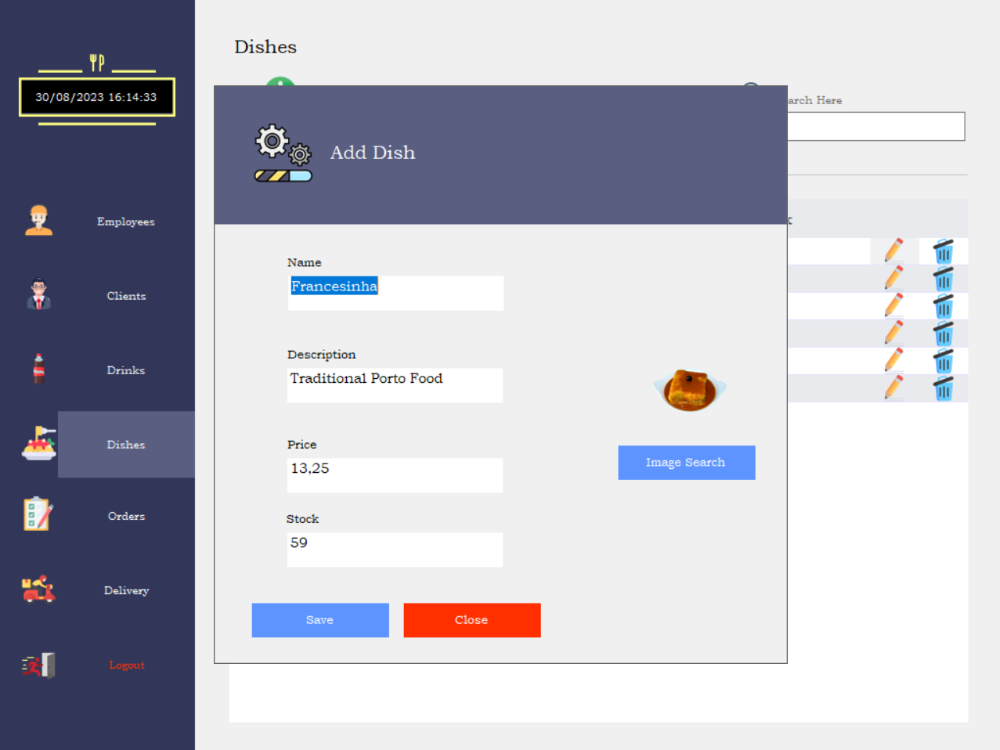

### **Orders** 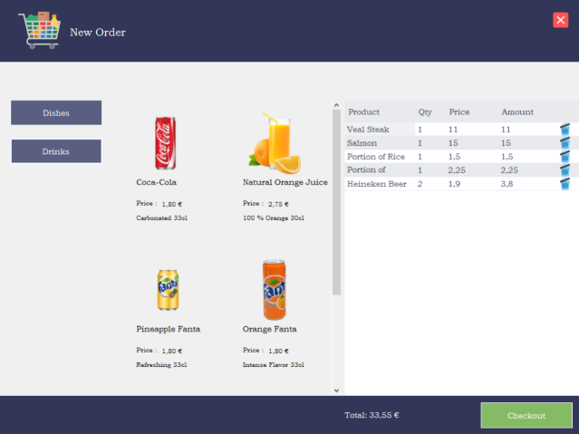 

The program's Order Dashboard – a comprehensive, central hub that encompasses a wide range of functionality. Here's an overview of what this tool can do:

- Display all requests and their current status.
- Orders by default start as "Pending" and are assigned estimated progression times.
- The order number is colored based on its status.
-It is possible to advance the time or day using the corresponding button
- Generates alert messages if orders are late in relation to the program time.
- Implements a periodic delay check cycle for timely updates.
- There is the possibility of filtering orders by status or customer name.
- It is possible to conveniently export all data to a CSV file using the printer icon.
- Whenever an order is in "Delivered" status, the next status prediction column is empty.

"Delivery" orders are transferred to the Delivery Panel when they reach the "Ready for Delivery" status, with the status button being disabled.

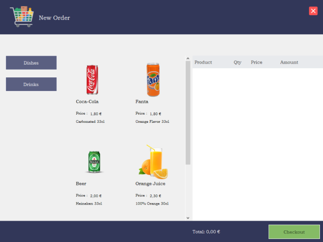

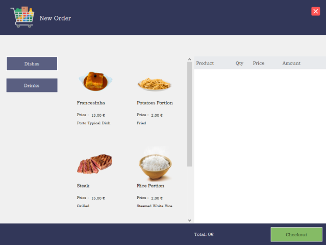

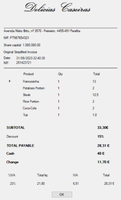

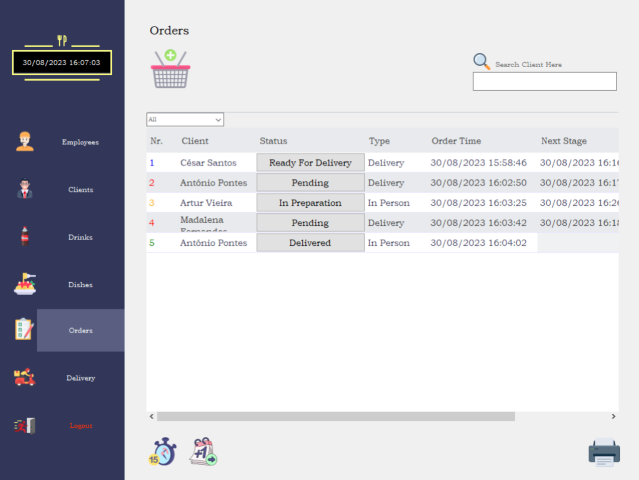

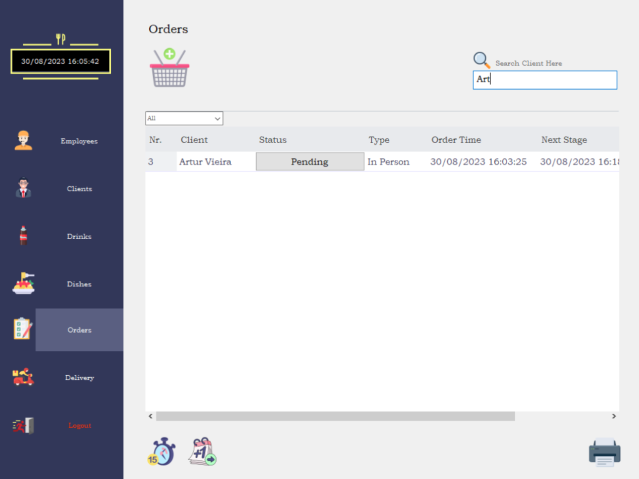

### **Deliveries**  

In this panel, orders that are Ready for Delivery are displayed, and when a delivery person finishes the delivery, they click on the status button, and the order disappears from the deliveries panel and becomes available again in the Orders panel, with the Delivered status.

!!!!!!!!!!!!!!!!!!!!!!!!!!!!!!!!!!!!!!!!!!!!!!!!!!!!!!!!!!!!!!!!!!!!!!!!!!!!!!!!!!!!!!!!!!!!!!!!!!!!!!!!!!!!!!!!!!!!!!!!!!!!!!!!!!!!!!!!!!!!!!!!!!!!!!!!!!!!!!!!!!!!!!!!!!!!!!!!!!!!!!!!!!!!!!!!!!!!!!!!!!!!!!
Category Selection: In the new order panel, there is the option to choose between two main categories: Drinks and Dishes. When you click one of these buttons, a list of articles available in the selected category is displayed.

Adding Products: As products are selected from the list, a table is automatically updated to show the product name, the chosen quantity and the corresponding value.

Product Removal: If necessary, it is possible to delete products from the order table. This provides flexibility to adjust the order before finalizing it.

Calculation of the Purchase Total: At the bottom of the order table, the code automatically calculates the purchase total, adding the values of all selected products.

Checkout: After selecting the desired products and checking the purchase total in the table, you can proceed to the next step by clicking the "Checkout" button to complete the order.
