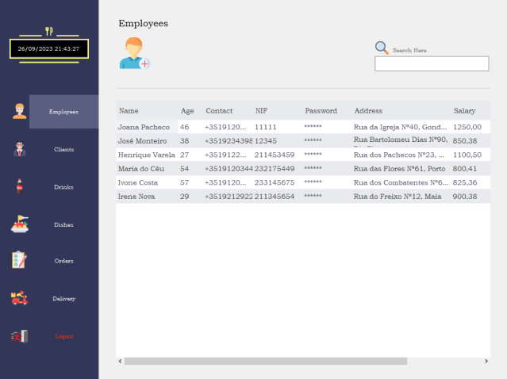
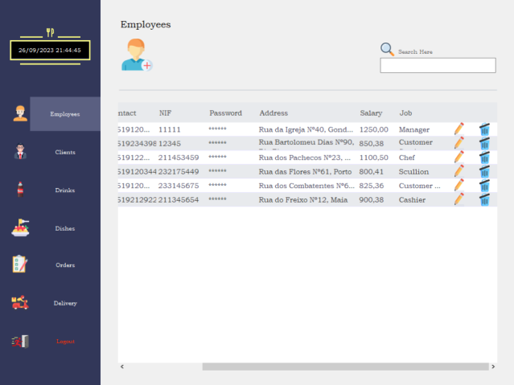
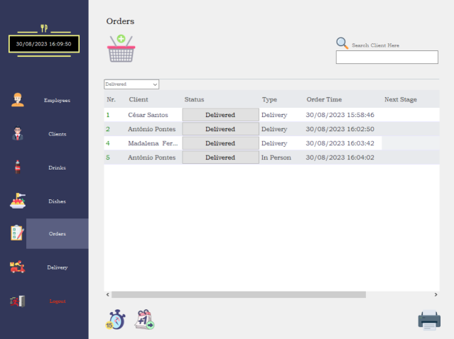

# Delícias Caseiras

# **Introduction**

The **Delícias Caseiras** application was developed to optimize and simplify the internal management of orders and deliveries, customers, employees, and stocks of a take-away establishment. This application is dedicated exclusively to internal use, aiming to improve operational efficiency and enhance the customer experience.

Through the classes used, the application accurately models all stages of the process. All information is stored in CSV files for later consultation or data storage.

When customers place orders through social networks or telephone contact, they are entered into the system by an employee who monitors this section, taking appropriate follow-up until they reach the customer's home.

The different sections of the program will be available depending on the position in the company, as soon as the employee enters the access credentials.

Each order has distinct states, from "pending" to "delivered," with specific dates assigned.

The **Restaurant** class assumes responsibility for storing the record of all orders, maintaining global tracking of ongoing operations.

The interactive form provides features such as adding, excluding, editing, and removing customers, stocks, employees, and orders. In addition, the application offers the facility to calculate the total value of each order, considering the selected dishes and drinks, as well as verifying the amount invoiced per customer in a designated time interval.

The implementation of an order status forecast system further enhances customer service, ensuring timely and reliable deliveries, as any delay that occurs will be alerted.

In short, the **Delícias Caseiras** application represents a technological solution dedicated exclusively to the internal management of the establishment, promoting an agile and precise organization of all the processes involved.

# **Functionalities**

## **Login**  

When the application is launched, access credentials will be requested so that it is possible to verify the existence, in storage, of information relating to any employee. If the fields match the data of a company employee, the windows related to the assigned status/function will be made available.

By default, password data is encrypted, but there is the option to view or hide the entered characters again.

If the operation has full access, that is, if it is the "Manager," the Menu will be presented as follows:

On the other hand, if it is an employee other than the "Manager," the Menu will be presented as follows:

### **Employees**  

Panel where all employees are displayed. It is possible to add, edit, or delete (Error messages will be displayed if the fields are unfilled or in the wrong format). Furthermore, searching for customers by name is possible through the filter box.

### **Clients**  

Similar to employees, there is a client management panel, with the main difference being the ability to calculate the amount spent between two entered dates.

### **Drinks and Dishes**  

The drinks and dishes panels follow the same reasoning, allowing for the addition, editing, or deletion of a product. The ability to add an image from the local machine to the respective product has been implemented.

### **Orders**  

The program's Order Dashboard – a comprehensive, central hub that encompasses a wide range of functionality. Here's an overview of what this tool can do:

- Display all requests and their current status.
- Orders by default start as "Pending" and are assigned estimated progression times.
- The order number is colored based on its status.
-It is possible to advance the time or day using the corresponding button
- Generates alert messages if orders are late in relation to the program time.
- Implements a periodic delay check cycle for timely updates.
- There is the possibility of filtering orders by status or customer name.
- It is possible to conveniently export all data to a CSV file using the printer icon.

"Delivery" orders are transferred to the Delivery Panel when they reach the "Ready for Delivery" status, with the status button being disabled.

### **Deliveries**  

In this panel, orders that are Ready for Delivery are displayed, and when a delivery person finishes the delivery, they click on the status button, and the order disappears from the deliveries panel and becomes available again in the Orders panel, with the Delivered status.

