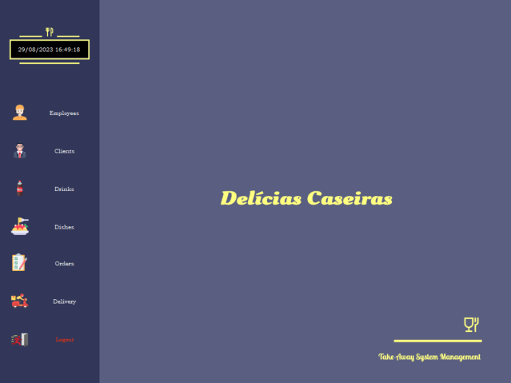
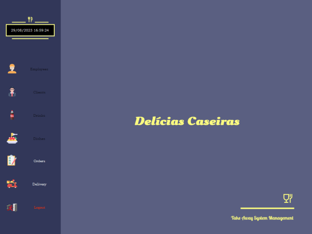
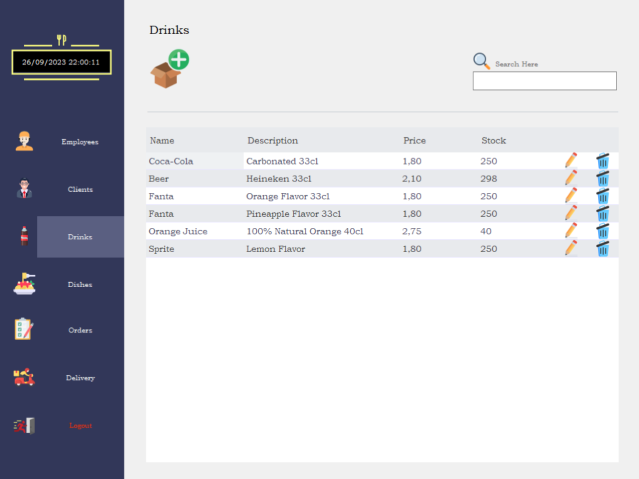
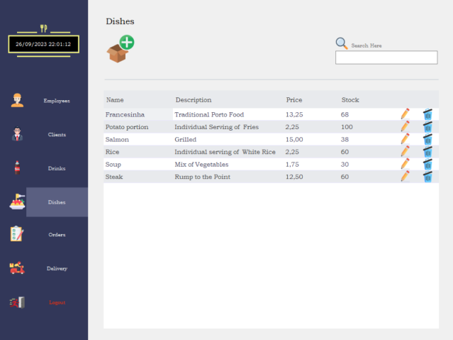

# Delicias Caseiras

## Intruduction

The "Delícias Caseiras" application was developed to optimize and simplify the internal management of orders and deliveries, customers, employees and stocks of a establishment (take-away). Dedicated exclusively to internal use, the application aims to improve operational efficiency and the customer experience.

Through the classes used, the application accurately models all stages of the process.

All information is stored in csv files for later consultation or data storage.

When customers place orders through social networks or telephone contact, they are entered into the system by an employee who monitors this section, taking the appropriate follow-up until they reach the customer's home.

The different sections of the program will be available depending on the position in the company, as soon as the employee enters the access credentials.

Each order has distinct states, from "pending" to "delivered", with specific dates assigned.

The "Restaurant" class assumes responsibility for storing the record of all orders, storing the global tracking of ongoing operations.

The interactive form provides features such as adding, excluding, editing and removing customers, stocks, employees and orders. In addition, the application offers the facility to calculate the total value of each order, considering the selected dishes and drinks, as well as verifying the amount invoiced per customer in a designated time interval.

The implementation of an order status forecast system further enhances customer service, ensuring timely and reliable deliveries, as any delay that occurs will be alerted.

In short, the "Delícias Caseiras" application represents a technological solution dedicated exclusively to the internal management of the establishment, promoting an agile and precise organization of all the processes involved.

## Functionalities

### Log In

When the application is launched, access credentials will be requested so that it is possible to verify the existence, in the storage, of information relating to any employee. If the fields match the data of a company employee, the windows related to the assigned status/function will be made available.

By default, password data is encrypted, but there is the option to view or hide the entered characters again.

If the operation has full access, that is, if it is the "Manager", the Menu will be presented as follows:

On the other hand, if it is an employee other than the "Manager", the Menu will be presented as follows:

### Employees

Panel where all employees are displayed. It is possible to add, edit or delete (Error messages will be displayed if the fields are unfilled or in the wrong format). Furthermore, searching for customers by name is possible through the filter box.

### Clients

Like employees, there is a client management panel, the main difference being the possibility of calculating the amount spent between two dates entered.

### Drinks and Dishes

The drinks and dishes panels follow the same reasoning, making it possible to add, edit or delete a product. The possibility of adding an image from the local machine to the respective product has been implemented.

### Orders
The order panel is the most comprehensive, concentrating most of the program's functionalities. On the main panel, all requests and their respective status are displayed, and it is possible to modify the status using the corresponding button. All requests start in the "Pending" state by default, and are assigned an estimated time to advance to the next phase. The number of each order adopts a different color depending on the state.
If the day or time advance buttons are pressed and the order is delayed in relation to the program time, alert messages will be displayed. A delay check cycle has been implemented, which is executed every X time units.